<div align="center">

<svg xmlns="http://www.w3.org/2000/svg" viewBox="0 0 880 200" width="528" height="120" fill="currentColor" role="img" aria-label="CEZAR">
  <title>CEZAR</title>
  <path fill-rule="evenodd" d="M20 20H180V180H20ZM52 52H148V148H52ZM76 70L76 130L126 100Z"/>
  <g transform="translate(127 0)">
    <path fill-rule="evenodd" d="M73 20H183V52H105V148H183V180H73ZM209 20H319V52H241V84H297V116H241V148H319V180H209ZM345 20H455V52L385 148H455V180H345V148L415 52H345ZM481 180L511 20H561L591 180ZM520 110L530 50H542L552 110ZM513 180L525 130H547L559 180ZM617 20H727V102H649V180H617ZM649 42H705V80H649ZM649 102H681L727 180H695Z"/>
  </g>
</svg>

**Software delivery life cycle cockpit for managing projects and co-working with agents.**

Coordinate humans and AI agent teams across the GitHub issue lifecycle — from
intake and triage, through autofix, to a draft PR ready for review. Agents do
the routine; you keep control of the judgment calls.

[What it solves](#what-it-solves) · [Who it's for](#who-its-for) · [Quick start](#quick-start) · [How the loop works](#how-the-humanagent-loop-works) · [Built-in actions](#built-in-actions)

[](LICENSE)


</div>

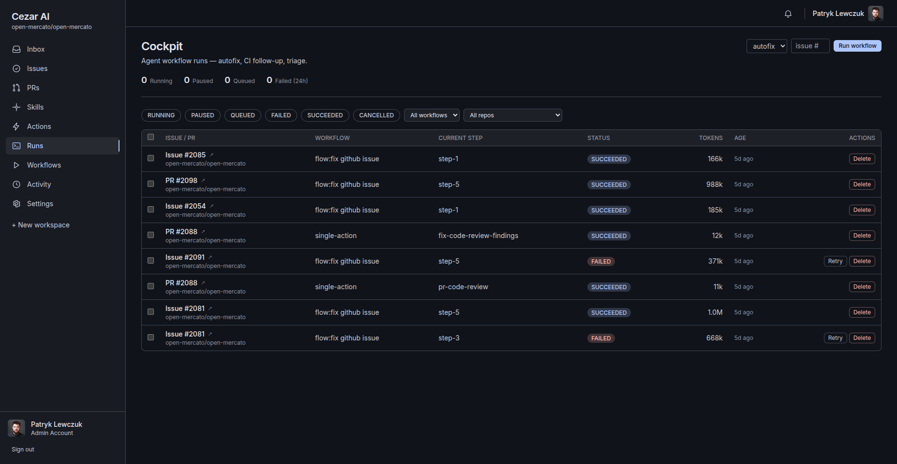

---

## What it solves

Most "AI for GitHub" tools are point solutions — a labeler, a duplicate
detector, an autofix bot. Run a few side by side and you end up with no
shared model, no shared visibility, and no clear place for the human to step
in. Cezar is the **cockpit** that pulls those jobs into one delivery flow.

- **Backlog outpaces triage.** New issues sit unlabeled and unprioritized for
  days. Cezar auto-triages every incoming issue on webhook — type, priority,
  duplicates, missing-info — and posts one summary comment, not a wall of bots.
- **No visibility into what agents are doing.** Once you have more than one
  agent running, you stop knowing which run is paused, which failed, which
  ate its turn budget. The cockpit shows every run live, with pause / cancel
  / resume / retry / delete on each row.
- **Hand-off without losing control.** Agents handle the routine; **human-gate**
  steps pause the workflow on low-confidence decisions so you approve before
  anything ships. Fixes land as draft PRs — never auto-merge.
- **Customization without forking.** Actions are data-driven specs, skills are
  Markdown playbooks pulled from your repo's `.ai/skills/`. Override a built-in
  via a clone-and-edit in the GUI, no TypeScript plugin required.
- **Bring your own agent backend.** Anthropic API, Claude Code CLI, or Codex
  CLI — pick per workflow step. Run subscription CLIs on your own infra under
  your own login via the self-hosted runner.

---

## Who it's for

- **Engineering leads** managing a steady inbound of bug reports and feature
  requests, who want delegation without losing the audit trail.
- **OSS maintainers** whose backlog grows faster than triage time and who want
  one consistent voice on issues — not five bot comments.
- **Platform / DevEx teams** rolling out agent workflows across multiple repos
  and looking for shared observability, shared playbooks, and shared gates.
- **Solo devs** running through an issue backlog one-off — the CLI mode works
  against a local JSON store, no SaaS or DB required.

---

## Screenshots

A tour of the surface area, grouped by capability.

### The cockpit — every run, live


<!-- TODO SCREENSHOT: The /dashboard page after a fresh workspace — stat row
     (Open / Closed / PRs open / Digested / Bugs), the "Recent agent runs"
     card, and the action grid below. Save as: docs/images/dashboard.png -->


<!-- TODO SCREENSHOT: The /cockpit list with several rows selected via
     checkbox and the bulk-action bar visible at the top (Pause selected ·
     Cancel selected · Retry selected · Delete selected). Save as:
     docs/images/cockpit-bulk-controls.png -->


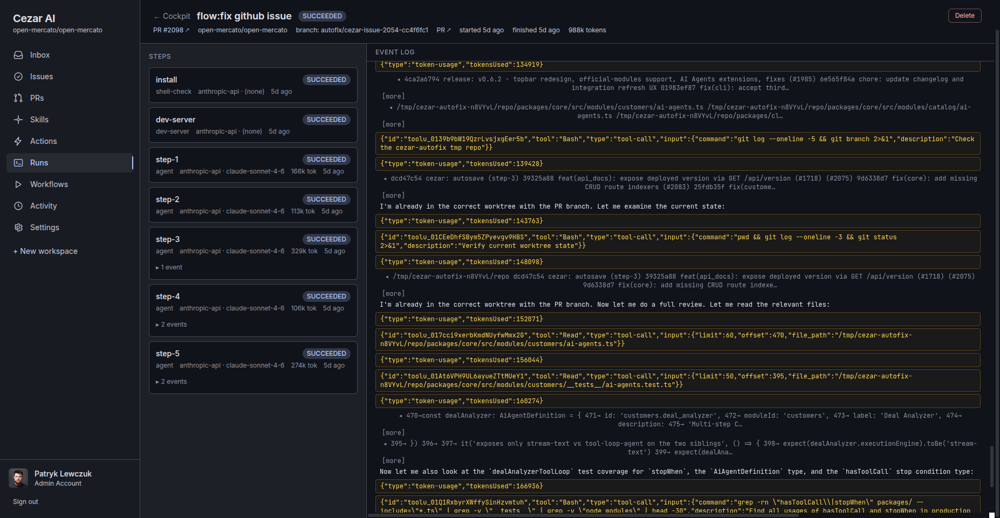

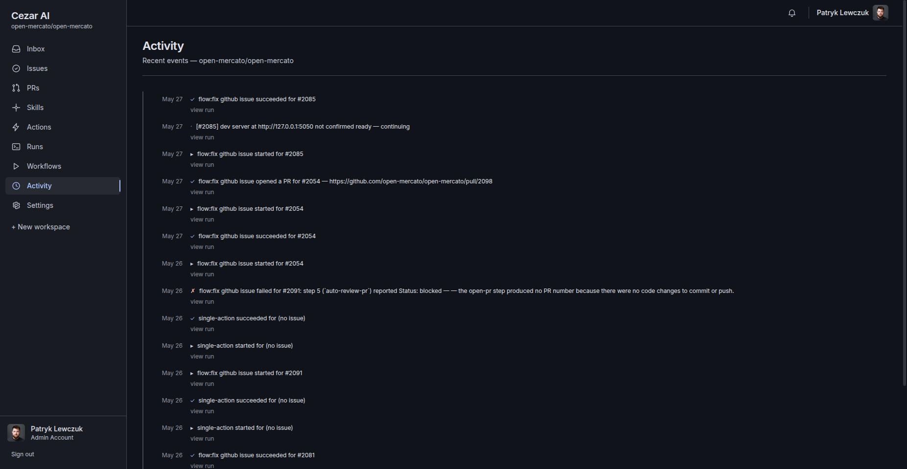

### Triage on every incoming issue

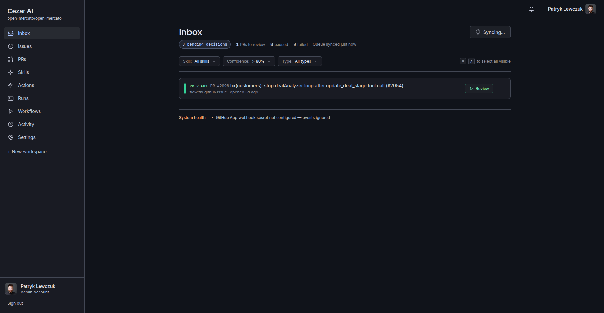

<!-- TODO SCREENSHOT: A GitHub issue page right after Cezar's triage pass —
     labels applied (bug · priority/high · area/api), the auto-triage comment
     with a concise summary and the actions Cezar took. Save as:
     docs/images/github-issue-triaged.png -->


<!-- TODO SCREENSHOT: A GitHub issue marked as duplicate by Cezar — the
     `duplicate` label set, the comment linking to the canonical issue with
     the confidence score and the matching signals it found. Save as:
     docs/images/github-duplicate-detected.png -->


<!-- TODO SCREENSHOT: A GitHub issue showing Cezar's single "living" comment
     with the per-step progress (verify-in-repo ✓ · root-cause ✓ · fix ⏳).
     Save as: docs/images/github-issue-comment.png -->


### Humans stay in control

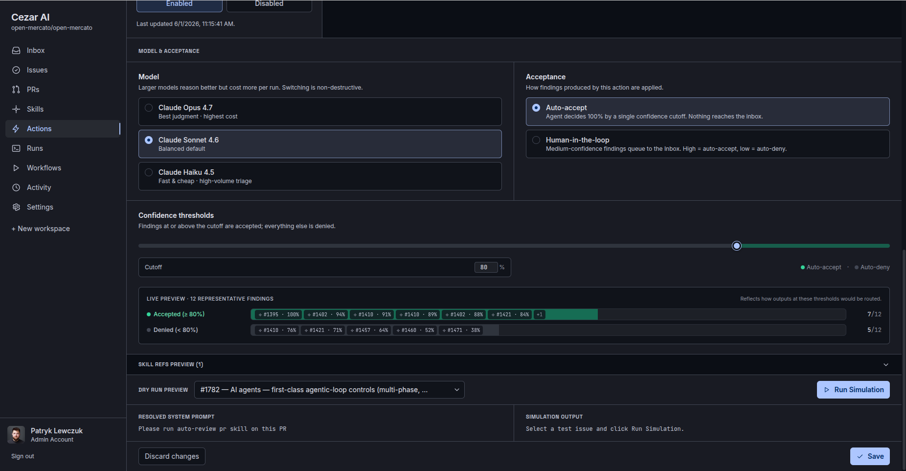

<!-- TODO SCREENSHOT: A run-detail page paused on a human-gate step — the
     step graph shows the gate in yellow/amber, the panel on the right shows
     the reason ("low confidence: 0.62 on bug-vs-feature"), the agent's
     reasoning, and Approve / Reject / Skip buttons. Save as:
     docs/images/human-gate-paused.png -->


<!-- TODO SCREENSHOT: The approval modal triggered from a human-gate — full
     context panel (issue text, agent's proposed effects, diff preview if
     applicable), an optional comment field, and the Approve & resume button.
     Save as: docs/images/human-gate-approve.png -->


<!-- TODO SCREENSHOT: A failed run page with the "Retry from step" picker
     open — listing every step in the workflow and letting the user pick
     which one to restart from (with a "use a different model" override).
     Save as: docs/images/cockpit-retry-from-step.png -->


### The output — a draft PR ready for review

<!-- TODO SCREENSHOT: A draft PR on GitHub opened by Cezar — title prefixed
     with "[cezar]", the structured PR description (Problem · Root cause ·
     Fix · Verification · Risks), the cezar:pr-link marker, and the draft
     badge. Save as: docs/images/github-draft-pr.png -->


<!-- TODO SCREENSHOT: A GitHub PR showing the CI-followup loop in action —
     the failed CI check, then Cezar's comment classifying the failure, then
     a new commit pushed with the patch and a re-running CI check. Save as:
     docs/images/github-ci-followup.png -->


---

## Quick start

The recommended path: self-hosted SaaS (full cockpit + auto-triage) against
the local Supabase docker stack. Two other paths — solo-use CLI and an
optional self-hosted runner — are in [`docs/INSTALL.md`](docs/INSTALL.md).

```bash
git clone https://github.com/comerito/cezar.git
cd cezar
yarn install

# 1. start the local Supabase stack (db + kong + Realtime in Docker)
yarn db:start

# 2. set env vars (see docs/SELF-HOSTING.md for the full list)
cat > .env.local <<EOF
NEXT_PUBLIC_SUPABASE_URL=...
SUPABASE_SERVICE_ROLE_KEY=...
ANTHROPIC_API_KEY=sk-ant-...
GITHUB_APP_ID=...
GITHUB_APP_PRIVATE_KEY="-----BEGIN..."
GITHUB_APP_WEBHOOK_SECRET=...
CRON_SECRET=...
NEXT_PUBLIC_APP_URL=https://app.example.com
EOF

# 3. run
yarn workspace @cezar/gui dev
```

Then install the GitHub App on your repo, walk through the **Workspaces → New**
wizard (project env preset, label-catalog analysis, workflow defaults), and
open `/dashboard`. New issues will start triaging automatically.

<!-- TODO SCREENSHOT: The /workspaces/new wizard — step 1 (pick a GitHub repo
     from the installed App), step 2 (project env preset), step 3 (label-
     catalog analysis kicking off), step 4 (workflow defaults). Save as:
     docs/images/workspace-wizard.png -->


> Prefer a no-DB, no-SaaS path? The solo-use CLI runs against a local JSON
> store. See [`docs/INSTALL.md`](docs/INSTALL.md#option-1--solo-use-cli).

<!-- TODO SCREENSHOT: Terminal screenshot of the `cezar` interactive hub —
     the setup-wizard greeting, then the main menu of analysis actions
     (bug-detector, duplicates, auto-label, …). Save as: docs/images/cli-hub.png -->


---

## How the human–agent loop works

A bug report lands on GitHub. The GitHub App webhook enqueues a **triage** job.
The triage pass runs every enabled Action whose trigger matches `on-issue-opened`,
in deterministic order. If a fix is in scope, the autofix workflow kicks off:
`verify-in-repo → root-cause → fix → review-loop → open PR (draft)` — and any
step can be a **human-gate** that pauses until you approve.

```
                ┌────────────────────────────────────────────────┐
GitHub  ──►─── │  webhook (issues.opened)                       │
                │   └─► jobs (deduped)                           │
                └────────────────────────────────────────────────┘
                                  │
                                  ▼
            ┌─────────────────────┼─────────────────────┐
            ▼                     ▼                     ▼
      Triage pass         Autofix workflow       CI follow-up
      ┌────────────┐      ┌──────────────────┐   ┌───────────────┐
      │ bug detect │      │ verify-in-repo   │   │ classify CI   │
      │ priority   │      │ root-cause       │   │ failure       │
      │ duplicates │      │ fix              │   │ patch + push  │
      │ auto-label │      │ review-loop      │   └───────────────┘
      │ …          │      │ open PR (draft)  │
      └────────────┘      └──────────────────┘
            │                     │
            ▼                     ▼
   agent_run_events ──realtime──► Cockpit UI
                                  │
                          human-gates pause here
                          for your approval
```

Every step writes structured events; the cockpit (`/cockpit`, `/cockpit/[runId]`)
subscribes via Supabase Realtime and renders the step graph filling in live. A
single *living comment* on the issue (then the PR) is edited as steps complete —
one comment per run, not a wall of bot chatter.

For the underlying data model, the Action spec, the workflow engine, and the
runner abstraction, see [`docs/ARCHITECTURE.md`](docs/ARCHITECTURE.md).

---

## Core concepts

Four ideas, each one a thin wrapper over the next. Full reference in
[`docs/ARCHITECTURE.md`](docs/ARCHITECTURE.md).

- **Actions** are your team's playbook, encoded once: a system prompt, a list
  of skills, a set of allowed effects (`label.add`, `comment`, `close`, …),
  and a trigger. No bespoke TypeScript — just data. 15 built-ins ship; you
  can override any of them per workspace, or write new ones in the GUI.
- **Skills** are Markdown playbooks pulled from your repo's `.ai/skills/`
  (built-in fallbacks ship with `@cezar/core`). Any Action composes them into
  its prompt — so you customize *how* an agent reasons without forking Cezar.
- **Workflows** chain steps into a multi-step pipeline (`agent` · `effect` ·
  `human-gate` · `commit` · `open-pr` · `push`). The autofix workflow is one;
  you can define your own per workspace.
- **Human gates** are the coordination piece. Any workflow step can pause for
  a decision — low-confidence triage, ambiguous fix, sensitive area of the
  codebase. The run sits in `paused` in the cockpit until you approve.

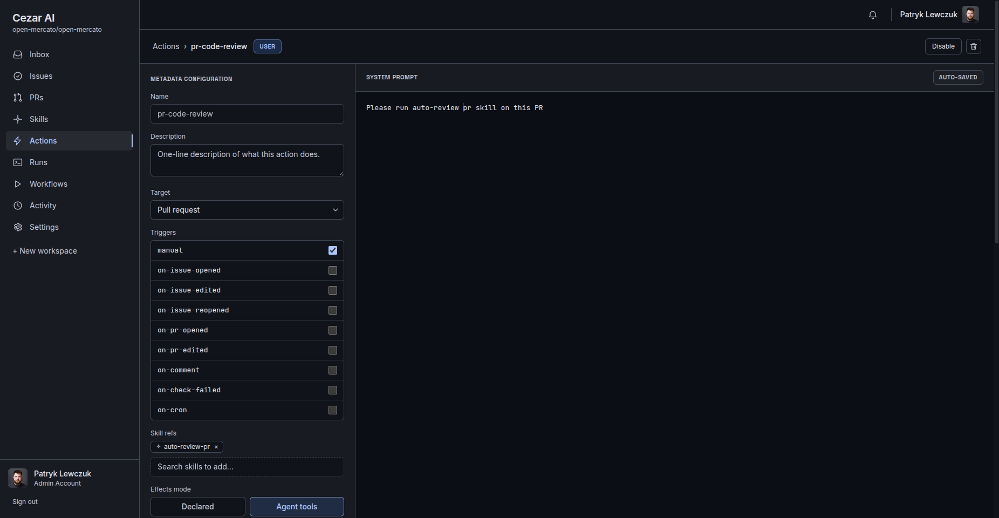


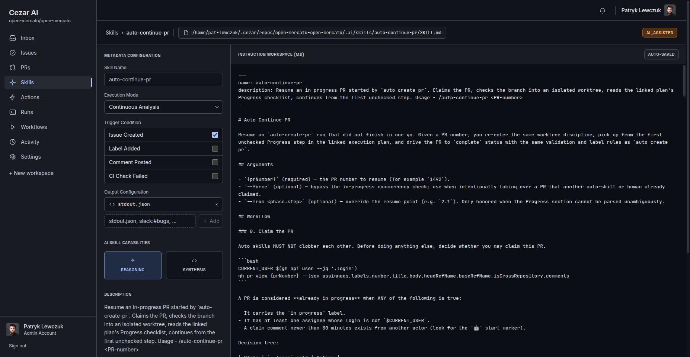

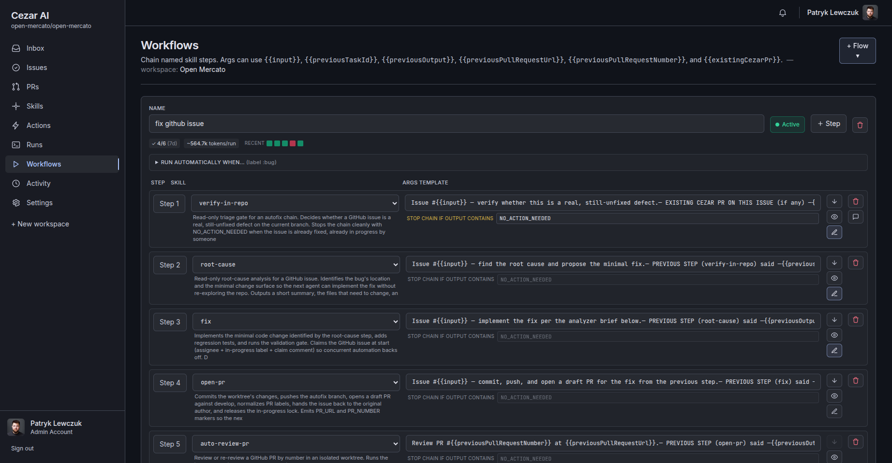

### Workspace label catalog

A per-workspace vocabulary of labels Cezar will apply, with add/remove
guidance per label. A **label-analysis job** scans your repo's existing labels
and the last 100 issues/PRs to learn maintainer conventions, then asks Claude
to synthesize a draft you edit in **Settings → Labels**. The accepted catalog
is appended to every agent step's system prompt — so agents apply *your*
labels with *your* semantics, and stop inventing new ones.

<!-- TODO SCREENSHOT: Settings → Labels — the label catalog editor showing a
     list of labels (name · scope · add-when · remove-when), the draft
     proposed by the label-analysis job highlighted with diff markers, and
     Accept / Edit / Reject controls per row. Save as: docs/images/settings-labels.png -->


---

## Built-in actions

15 Actions ship with `@cezar/core`. Each one is data — you can enable, disable,
override, or clone any of them in the GUI without touching code.

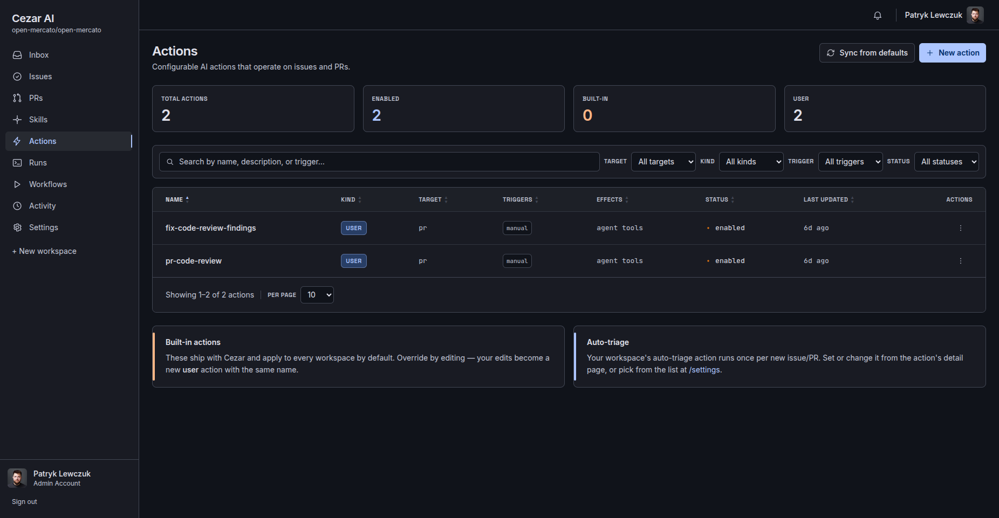

| Action | Triggers | Effects | What it does |
|---|---|---|---|
| `auto-triage` | `on-issue-opened`, `on-issue-reopened` | tool-use (`label.add`, `set-priority`) | First-pass orchestrator — type labels + priority for clear critical defects |
| `bug-detector` | `on-issue-opened`, `on-issue-edited` | declared (`label.add`) | Classify bug / feature / question / other with calibrated confidence |
| `priority` | `on-issue-opened` | declared (`set-priority`) | Impact-and-urgency rubric with cited signals |
| `duplicates` | `on-issue-opened` | tool-use (`link-duplicate`) | Detect duplicates against the open-issue knowledge base (conf ≥ 0.80) |
| `auto-label` | `on-issue-opened`, `on-issue-edited` | tool-use (`label.add`, `label.remove`) | Apply repo-defined labels — never invents new ones |
| `missing-info` | `on-issue-opened` | declared (`comment`, `label.add`) | Ask for missing repro info (3-5 bullets max) |
| `security` | `on-issue-opened`, `on-issue-edited` | declared (`label.add`, `comment`) | Flag security implications, false positives preferred |
| `quality` | `on-issue-opened` | declared (`label.add`) | Detect spam / vague / test / wrong-language submissions |
| `good-first-issue` | `on-issue-opened` | declared (`label.add`) | Surface newcomer-friendly issues with a code hint |
| `claim-detector` | `on-cron` | declared (`comment`) | Find stale claims (>14 days, no PR) and post a polite nudge |
| `contributor-welcome` | `on-issue-opened` | declared (`comment`) | Personalised first-timer welcome — references issue specifics |
| `recurring-questions` | `on-cron` | declared (`comment`) | Redirect open questions already answered in closed issues |
| `categorize` | `on-issue-opened` | declared (`label.add`) | Framework / domain / integration categorization |
| `done-detector` | `on-cron` | declared (`comment`, `close`) | Find issues silently resolved by merged PRs (conf ≥ 0.70) |
| `stale` | `on-cron` | declared (`comment`, `close`, `label.add`) | Triage stale issues — close / label / keep-open |

---

## Self-hosting

Cezar runs on a managed cloud path (`ANTHROPIC_API_KEY` + the in-process
dispatcher) by default. Add the optional `@cezar/runner` daemon if you want
subscription CLIs (`claude`, `codex`) to run under your own login on your
own infra. Full setup: [`docs/SELF-HOSTING.md`](docs/SELF-HOSTING.md).

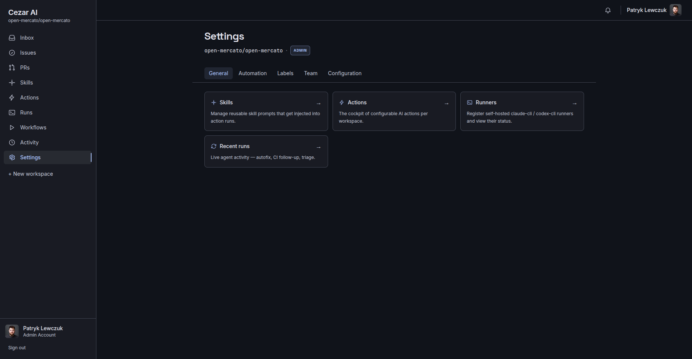

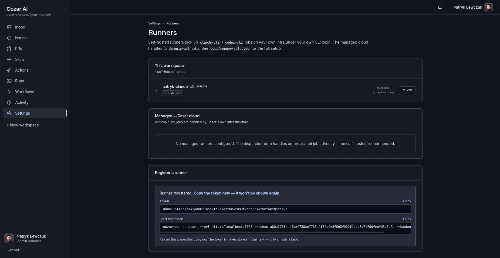


---

## Documentation

- [`docs/INSTALL.md`](docs/INSTALL.md) — the three install paths (CLI · SaaS · self-hosted runner).
- [`docs/ARCHITECTURE.md`](docs/ARCHITECTURE.md) — Action model, workflow engine, packages, data flow, runner abstraction.
- [`docs/SELF-HOSTING.md`](docs/SELF-HOSTING.md) — self-hosted runner, configuration, env vars.
- [`docs/DEVELOPMENT.md`](docs/DEVELOPMENT.md) — local dev, tech stack, adding new Actions and effects.
- [`CLAUDE.md`](CLAUDE.md) — operating manual for AI assistants editing this repo.
- [`MIGRATION.md`](MIGRATION.md) — activation runbook for the agent-cockpit refactor.
- [`DESIGN.md`](DESIGN.md) — design system spec for the GUI.
- [`docs/REFACTOR-PLAN-agent-cockpit.md`](docs/REFACTOR-PLAN-agent-cockpit.md) — design of record for the cockpit + workflow engine.
- [`cezar-ROADMAP.md`](cezar-ROADMAP.md) — what's next.

---

## Contributing

Bug fixes, new Actions, new skills, new effects — all welcome. Please read
[`CONTRIBUTING.md`](CONTRIBUTING.md) for the development workflow and code
standards (TypeScript strict, ESM, Zod at every boundary, tests for new logic).

Found a bug? Open an issue — Cezar will auto-triage it.

---

## License

[MIT](LICENSE) © [Comerito](https://github.com/comerito)
