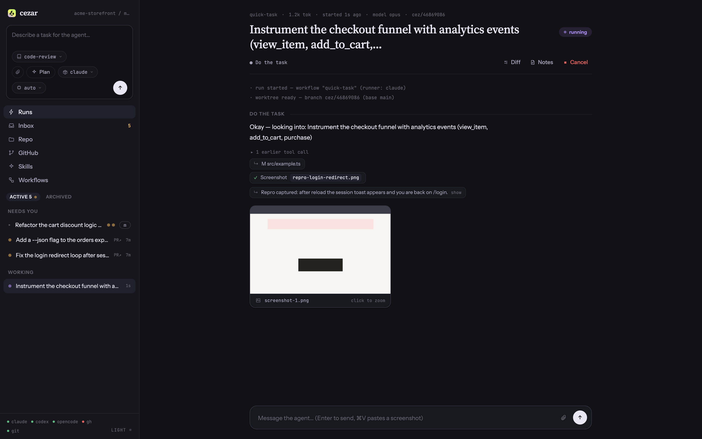
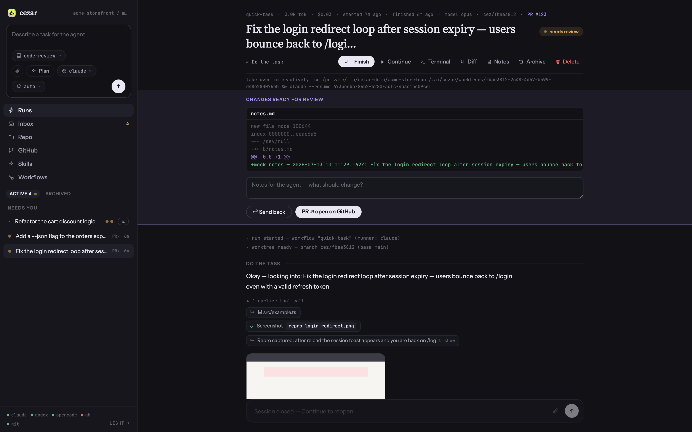
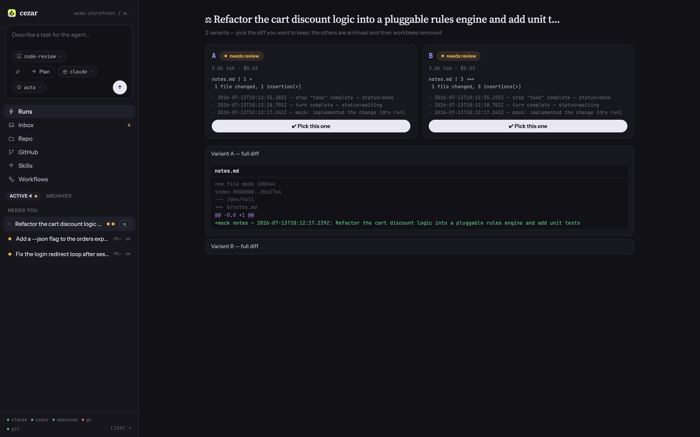
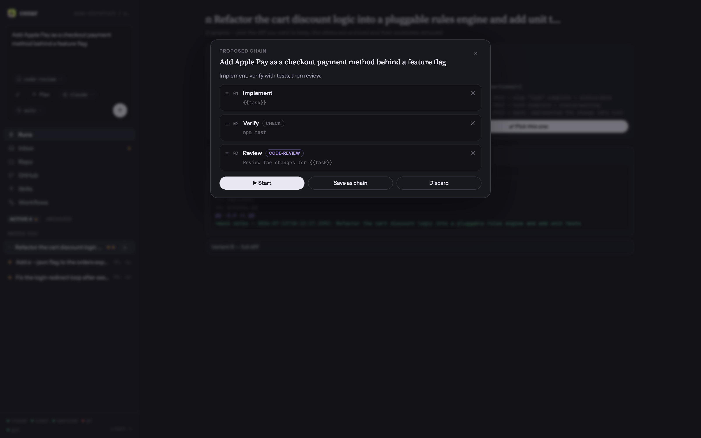
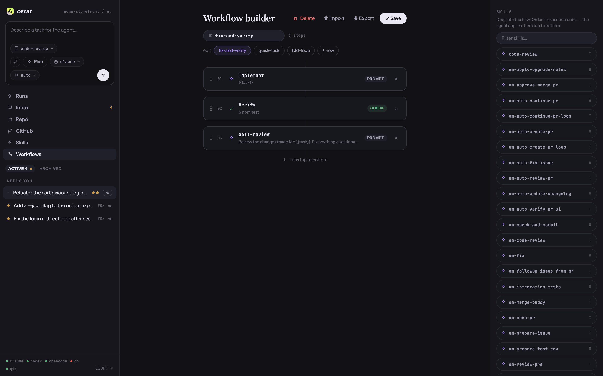
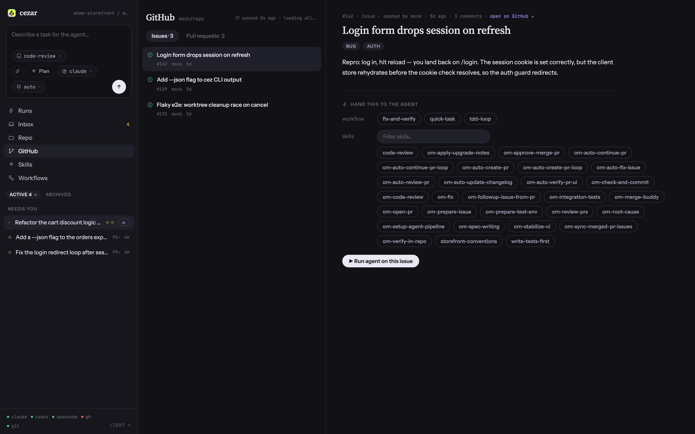

<div align="center">

# cezar ⚡

**A local cockpit for running and tracking AI coding-agent tasks in your repo.**

Type a task, pick a workflow, watch the agent work live — steps, tool calls,
tokens, diffs — in a browser cockpit that runs entirely on your machine.
Your `claude` login, your `gh`, your files. No accounts, no database, no cloud.

[A look inside](#a-look-inside) · [What it solves](#what-it-solves) · [Who it's for](#who-its-for) · [Quick start](#quick-start) · [How it works](#how-it-works) · [Core concepts](#core-concepts) · [Cockpit tour](#cockpit-tour)

[](#license)


</div>

---

```bash
cd your-repo
npx cezar-cli        # → cockpit at http://localhost:4321
```

That's the whole setup. If your `claude` CLI is logged in (Pro/Max) and `gh` is
authenticated, there is nothing else to configure. State lives in `.ai/cezar/`
inside your repo — plain JSON, NDJSON and Markdown you can `cat` and fix by hand.

## A look inside

Click any thumbnail for the full-size screenshot.

| Watch a run live | The review gate | Parallel variants |
|:--:|:--:|:--:|
| [](docs/screenshots/live-run.png) | [](docs/screenshots/review-gate.png) | [](docs/screenshots/variants-compare.png) |
| *Every step, tool call, token and screenshot — streamed as it happens.* | *Nothing auto-merges: inspect the diff, send notes into the same session, or push a draft PR.* | *Run a task ×2/×3 in isolated worktrees, compare the diffs, keep one.* |
| **Plan before you run** | **Workflow builder** | **GitHub, one drag away** |
| [](docs/screenshots/plan-chain.png) | [](docs/screenshots/workflow-builder.png) | [](docs/screenshots/github-issues.png) |
| *Press **Plan** and review the proposed chain — trim, reorder, then start.* | *Stitch skills and shell checks into a reusable YAML chain, no code.* | *Open issues and PRs via your `gh` — run the agent straight on an issue.* |

---

## What it solves

Most "AI coding agent" tooling makes you choose between a **terminal** you can't
see into once it's running, and a **cloud product** that wants your API key, your
code on their servers, and an account. cezar is the third option: the agent runs
locally under *your* subscription, and a cockpit shows you exactly what it's doing.

- **No visibility into a running agent.** A headless `claude` run is a black box
  until it finishes. cezar streams every step — agent text, each tool call and
  its result, tokens and cost per step — live, and keeps the full replay.
- **One agent, one working tree, one thing at a time.** Kick off a second task and
  it fights the first over your files. cezar runs each task in its **own git
  worktree**, so two (or three) agents work in parallel without stepping on
  each other — or on the branch you're editing.
- **The agent finishes and you have to trust it.** cezar ends non-trivial runs at
  a **review gate**: inspect the diff, send notes back into the same session, or
  push a **draft PR** — never an auto-merge.
- **Losing a session when it fails.** Every run records its `claude` session id.
  Take it over interactively in one click (`claude --resume <id>`), or continue it
  in-process from the cockpit.
- **Setup tax.** No wizard, no env vars, no schema. Skills are Markdown, workflows
  are short YAML, and everything degrades: no `gh` → works without PRs, no network
  → local skills still load, no `.ai/skills` → the bare prompt still runs.

---

## Who it's for

- **Solo devs and small teams** who want the leverage of coding agents without
  handing their code and keys to a SaaS — the agent runs on your subscription,
  on your machine.
- **`claude` CLI power users** who love headless runs but want to *see* them,
  compare a few attempts side by side, and review a diff before it lands.
- **Anyone with a backlog** who'd rather queue three tasks into isolated worktrees
  and pick the winners than babysit one terminal.
- **Teams with shared conventions** who want their playbooks (skills) pulled from
  a git repo, applied consistently, with zero per-project setup.

---

## Quick start

**Prerequisites:** Node 20+, the [`claude` CLI](https://github.com/anthropics/claude-code)
logged in (Pro/Max subscription), and — optionally — `git` and the `gh` CLI.

```bash
cd your-repo
npx cezar-cli              # start the cockpit for the current repo
#   or: npx @pat-lewczuk/cezar
```

The cockpit opens at `http://localhost:4321` (auto-picks the next free port if
busy). Type a task, pick a workflow, hit **Start**. That's it.

```bash
npx cezar-cli run "add a --json flag to the export command"   # headless, CI-friendly
npx cezar-cli init                                            # scaffold .ai/cezar/
```

Both the `cezar` and `cez` commands are installed, so once it's on your PATH you
can run either. No API key is ever used — cezar shells out to your logged-in
`claude` CLI.

> **Just kicking the tires?** Set `CEZ_DRY_RUN=1` to run against a bundled mock
> instead of the real CLI — the whole cockpit works with no `claude` login, so
> you can explore runs, diffs, variants and the review gate offline.

---

## How it works

You describe a task. cezar runs it as a **workflow** — an ordered list of agent
steps and shell checks — shelling out to your `claude` CLI in headless
stream-json mode. Each task gets its own git worktree; the cockpit streams every
event live and parks the run at a review gate when there's a diff to inspect.

```
   you type a task
        │
        ▼
   ┌─────────────┐   optional: Plan → AI drafts a chain of steps you approve
   │  workflow   │   (agent steps + shell checks, with bounded onFail retries)
   └─────────────┘
        │
        ▼
   ┌──────────────────────────────┐     ┌───────────────────────────────┐
   │  git worktree per task       │     │  claude CLI  (your login)     │
   │  (isolated branch, parallel) │◄───►│  stream-json · default-deny   │
   └──────────────────────────────┘     │  tools · acceptEdits in-repo  │
        │                                 └───────────────────────────────┘
        │  agent text · tool calls · tool results · tokens · cost
        ▼
   ┌─────────────┐   SSE (replay + live)   ┌──────────────────────────┐
   │ .ai/cezar/  │ ──────────────────────► │  cockpit  localhost:4321 │
   │ JSON·NDJSON │                         │  Runs · Repo · GitHub ·  │
   │ ·Markdown   │                         │  Skills · Workflows      │
   └─────────────┘                         └──────────────────────────┘
                                                  │
                                          review gate: read the diff →
                                          send notes back · draft PR · finish
```

When a check fails, the workflow can loop back to an earlier step (bounded by
`max`) with the failing output appended to the retried agent's prompt. Nothing
auto-merges: a run with changes rests in `review` until you act on it.

---

## Core concepts

Three words, no jargon — **task**, **skill**, **chain**:

- **Tasks** are the unit of work. Every task is a **run**: `queued → running →
  review / done / failed / cancelled`, with a live event log, per-step token and
  cost usage, cancel/delete, and — for anything with a diff — a review gate. Paste
  screenshots into the task, or send follow-up messages into the live session
  while it works.
- **Skills** are Markdown playbooks. Drop them in `.ai/skills/` or
  `.ai/cezar/skills/`, or pull them from a shared **team skills repo** (a bare
  git clone cached globally in `~/.cache/cez/`). A workflow step references one by
  `skill: <name>` and its body becomes the agent's extra system prompt — so you
  shape *how* the agent reasons without touching code.
- **Chains (workflows)** stitch steps into a pipeline: agent steps plus shell
  checks, with bounded `onFail` retry loops. Write the YAML yourself, build one by
  drag-ordering skills in the **Workflows** tab, or press **Plan** and let the AI
  draft a chain for your task that you review, trim and start. The built-in
  `quick-task` (one agent step) works with zero setup.

Two moves that make the cockpit worth the browser tab:

- **Parallel variants (×2 / ×3).** Run the same task as competing agents in
  separate worktrees, then compare their diffs side by side and **pick** one —
  the losers are archived and their worktrees cleaned up.
- **Review gate.** A finished run with changes waits in `review`. Read the diff,
  type notes that go straight back into the agent's session, or push a
  `gh pr create --draft`. You stay the merge button.

---

## Cockpit tour

Six tabs, one browser window, all live over Server-Sent Events:

| Tab | What's in it |
|---|---|
| **Runs** | Every task with its status, live event stream (agent text · tool calls · tool results · pasted/generated screenshots), tokens and cost. Continue, cancel, open in terminal (`claude --resume`), review the diff, or push a draft PR. |
| **Inbox** | Follow-ups an agent left behind (`todos.json`) — one click turns a suggestion into the next task, pre-wired to its suggested skill. |
| **Repo** | Branch, working-tree status, diff vs HEAD, recent commits (click one for its inline patch + GitHub link), and the configurable base branch that worktrees fork from and PRs target. |
| **GitHub** | Open issues and PRs of the repo's origin, read through your logged-in `gh`. Drag an issue onto the task box to prefill the prompt. |
| **Skills** | Local skills plus the team skills repo, with a rendered body + prompt preview. Refresh pulls the latest from the remote. |
| **Workflows** | Build a chain by drag-ordering skills, save it as portable YAML, import/export, or delete. Built-ins always come back. |

The whole GUI is dependency-free vanilla JS with no build step, a dark/light
theme toggle, and bookmarklets that launch a task straight from a GitHub page.

---

## Workflow format

A workflow is a small YAML file in `.ai/cezar/workflows/`:

```yaml
name: fix-and-verify
description: Implement the task, then verify; retry with failing output on red.
steps:
  - id: implement
    name: Implement
    prompt: "{{task}}"
    skill: project-conventions   # optional — from .ai/skills or .ai/cezar/skills
    # model: opus                # optional per-step model override
    # allowedTools: [Read, Edit, Write, Grep, Glob, Bash]
  - id: verify
    name: Verify
    command: "npm test"          # a check step: exit 0 passes
    onFail:
      retry: implement           # loop back to an earlier step…
      max: 2                     # …at most twice
```

`{{task}}` is replaced with the task text you typed. When a check fails and loops
back, its failing output is appended to the retried agent's prompt so the next
attempt can see what broke.

Prefer skills over steps? A workflow can also be written in the portable
shorthand — an ordered list of skill names, each becoming one agent step:

```yaml
name: triage-and-fix
skills: [reproduce, root-cause, implement, self-review]
```

---

## How it runs agents

cezar shells out to your locally installed, logged-in `claude` CLI in headless
`stream-json` mode — **your subscription, no API key**. Tool access is
default-deny via `--allowedTools`, and edits are auto-accepted
(`--permission-mode acceptEdits`) inside the task's worktree. Nothing runs on a
server you don't own.

Useful environment variables:

| Var | Effect |
|---|---|
| `CEZ_DRY_RUN=1` | Use the bundled mock instead of the real `claude` CLI — the entire cockpit works offline, for demos and development. |
| `CEZ_CLAUDE_BIN=/path/to/claude` | Override which `claude` binary is used. |
| `GITHUB_TOKEN` | Fallback for GitHub reads/PRs when `gh` isn't authenticated. |

---

## Configuration (optional)

Zero config is the default — everything below is opt-in via
`.ai/cezar/config.json` (a missing or invalid file simply uses the defaults, and
never blocks startup):

```jsonc
{
  "skillsRepos": [{ "repo": "open-mercato/skills", "ref": "main" }], // team skills; [] disables
  "maxParallel": 2,          // how many tasks may run at once (non-git dirs always run 1)
  "plannerModel": "sonnet",  // model the Plan button uses to draft chains
  "baseBranch": "develop"    // branch worktrees fork from + PRs target (also settable in the Repo tab)
}
```

Run data (`runs.json`, NDJSON event logs, worktrees, `todos.json`) is
git-ignored automatically; your workflows and skills stay committable.

---

## Development

```bash
npm install
npm run dev          # tsx src/index.ts — the cockpit, live-reloaded
npm run build        # tsc → dist/
npm run typecheck    # tsc --noEmit
```

The stack is deliberately small: **TypeScript** (strict, ESM), **Hono** + SSE for
the server, **Zod** at every boundary, **YAML** for workflows, and **vanilla JS**
for the GUI (no framework, no bundler). Every module is meant to be read in one
sitting.

---

## Relationship to cezar (the SaaS)

cez is the radically-simple, single-user sibling of
[**cezar**](https://github.com/comerito/cezar) — the team SaaS cockpit for
running agents across the whole GitHub issue lifecycle (auto-triage, webhooks,
Supabase, multi-repo). Same core ideas — agent runner, skills, declarative
workflows, a live run cockpit — with none of the accounts, database or cloud.
Start here; graduate to cezar when a team needs shared visibility.

---

## License

**MIT** © Patryk Lewczuk
